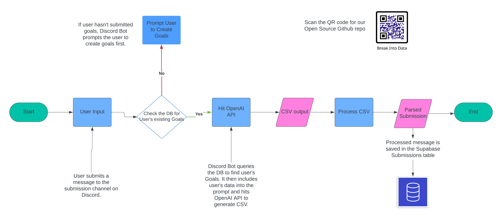

# Discord Accountability Bot

This Accountability bot is here to enhance your experience, helping you track your personal development goals, participate in challenges, and engage with the community. Whether you're focusing on improving your fitness, studying, coding, or any other personal growth area, our bot makes tracking your progress seamless and motivating.

And editable version of this diagram is [here](https://lucid.app/lucidchart/a9c157f6-8695-4d2a-b63d-3140dd41b394/edit?viewport_loc=34%2C-365%2C2194%2C1256%2C0_0&invitationId=inv_fa0ca8f2-a8ea-45d7-9d63-0f1b899232a2)

## Features

- **Goal Tracking Across Various Tracks**: Set and track goals in multiple areas, including Fitness, Leetcode, Studying, Meditation, Content Creation, and more.
- **Interactive Goal Setting and Updates**: Set new goals, update your progress, and stay committed to your personal growth journey.
- **Weekly Leaderboards**: Stay motivated with weekly leaderboards showcasing the most active and committed members in each category.
- **Personal Statistics**: Get insights into your weekly progress with personalized statistics, helping you understand your achievements and areas for improvement.
- **Community Engagement**: Participate in community-wide challenges and goal-setting activities, fostering a supportive and motivational environment.

## Getting Started

### Setting Up Your Goals

1. **Pick Your Track**: When you join the server or when the bot prompts, select your preferred track (e.g., Fitness, Leetcode) by clicking on the corresponding button.
2. **Declare your goals**: Enter the details of your goal, including any specific targets and metrics (e.g., 30 minutes of meditation daily).
3. **Submit Your Progress**: Use the `/submit` command followed by the amount you've achieved (e.g., `/submit 5` to log 5 Leetcode problems solved).

### Viewing Your Progress

- To view your personal statistics, including submissions and active days, use the `/stats` command. This will provide a breakdown of your weekly achievements.

### Participating in Leaderboards

- Weekly leaderboards will automatically be posted in the designated channel, showcasing top performers in each category. Engage with the community, celebrate achievements, and set new goals to climb the ranks!

## Commands Overview

- `/submit [amount]`: Submit your daily progress for a specific goal.
- `/stats`: Receive a summary of your personal stats for the last week.

## Support

Should you encounter any issues or have questions about using the bot, feel free to reach out to the server moderators or directly to Meri Nova for assistance on our server.

## Contributing

We're always looking to improve and expand the bot's functionalities. If you have suggestions or would like to contribute to the development, please mention it on the discord or submit an issue to this repository. Follow out [CONTRIBUTING.md](.github/workflows/CONTRIBUTING.md) file for more information on how you can be part of building this awesome bot. 